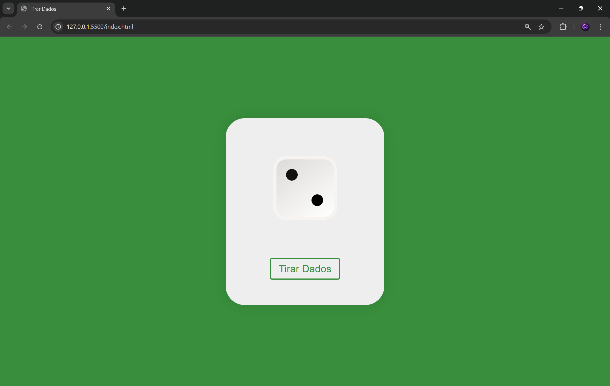

# 🎲 Simulador de Dado 3D

Este proyecto es un simulador de lanzamiento de un dado en 3D utilizando **HTML, CSS y JavaScript**.
Al presionar un botón, el dado gira con una animación y muestra un número aleatorio del 1 al 6.

---

## 🚀 Características

* 🎲 Dado en 3D usando `transform` de CSS
* 🎞️ Animación al tirar el dado
* 🔢 Resultado aleatorio del 1 al 6
* 🎨 Interfaz simple y limpia
* ⚡ Código ligero y fácil de entender

---

## 📁 Estructura del proyecto

```
📦 tirar-dado
 ┣ 📜 index.html
 ┣ 📜 estilos.css
 ┗ 📜 script.js
```

---

## 🛠️ Tecnologías utilizadas

* HTML5
* CSS3 (Transformaciones 3D y animaciones)
* JavaScript (Lógica y eventos)

---

## ▶️ Cómo usarlo

1. Descarga o clona el repositorio:

```
git clone https://github.com/tu-usuario/tu-repo.git
```

2. Abre el archivo `index.html` en tu navegador.

3. Haz clic en el botón **"Tirar Dado"**.

---

## 🧠 Cómo funciona

* JavaScript genera un número aleatorio del 1 al 6.
* Dependiendo del número, se aplica una rotación al dado usando `transform`.
* CSS se encarga de la animación y la apariencia 3D.

---

## 🎯 Posibles mejoras

* 🔊 Agregar sonido al lanzar el dado
* 🔢 Mostrar el número obtenido en pantalla
* 🎮 Crear un sistema de puntuación
* 👥 Modo multijugador
* 📱 Mejorar diseño responsivo

---

## 📸 Vista previa



---

## 📄 Licencia

Este proyecto es de uso libre para fines educativos.

---

## 👨‍💻 Autor

* Luis Orlando Flores Canizales

---

